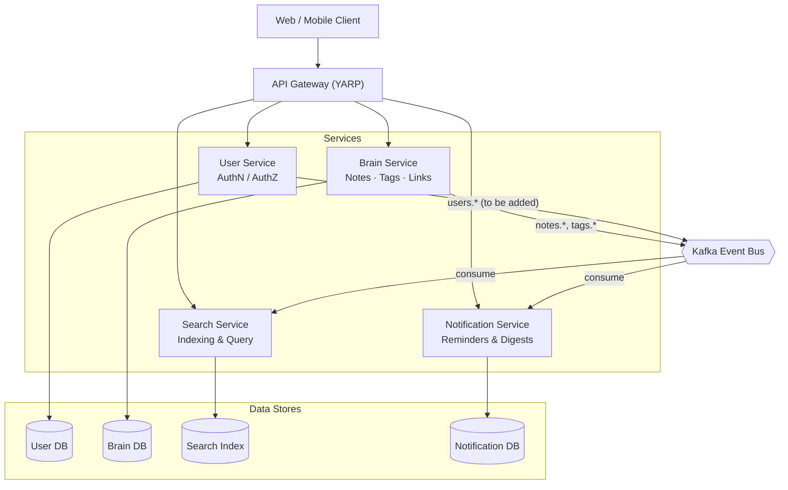
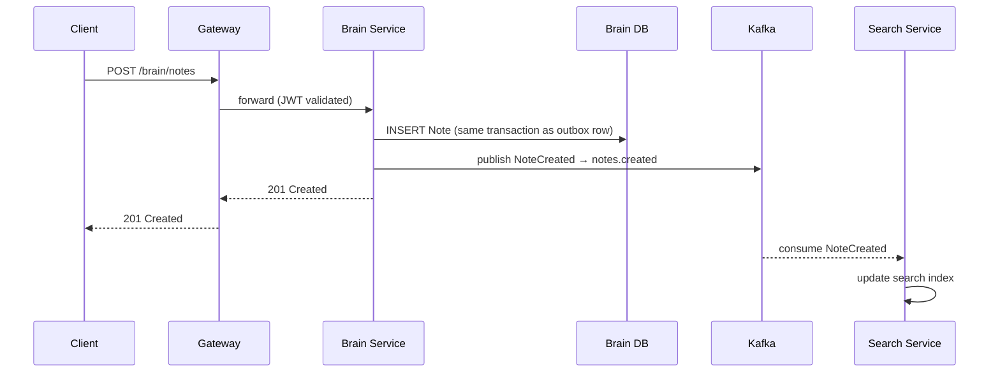

# Second Brain — Architecture

This document describes the system design for **Second Brain**: a microservices-based personal knowledge management (PKM) platform for capturing notes, linking ideas together (Zettelkasten-style), tagging them, searching across them, and resurfacing them over time.

It covers what's already implemented, what's scaffolded but empty, and what's missing to make the existing event-driven plumbing (Kafka topics, `IEventBus`, value objects like `NoteId`/`TagName`) actually do something.

## 1. Architecture style

- **Microservices**, one per bounded context, each owning its own database (database-per-service).
- **API Gateway** (YARP) as the single public entry point; internal services are not directly reachable by clients.
- **Event-driven integration** via Kafka for cross-service consistency (e.g., search indexing reacting to note changes) instead of synchronous service-to-service calls.
- **Shared kernel** (`SecondBrain.BuildingBlocks`) for cross-cutting concerns that would otherwise be duplicated: base entities, generic repository, pagination contracts, EF Core audit-timestamp behavior, and the Kafka abstractions.

## 2. Service catalog

| Service | Bounded context | Owns data | Status | Responsibilities |
|---|---|---|---|---|
| **Gateway** | Edge / routing | — | ✅ Implemented | Single entry point, routes `/brain/*`, `/user/*` (and future `/search/*`, `/notify/*`) to internal services via YARP |
| **User** | Identity & Access | Users (SQL Server) | ✅ Implemented | Registration, login, JWT issuance, password hashing (BCrypt), profile lookup |
| **Brain** | Knowledge core | Notes, Tags, Notebooks, Links (SQL Server) | 🚧 Scaffolded only — csproj + project reference, no domain code yet | CRUD for notes and tags, bi-directional links between notes (the actual "graph" of a second brain), ownership/authorization, publishing domain events |
| **Search** | Discovery | Search index (starts as SQL full-text, can move to Elasticsearch or a vector store) | 📝 Planned — not started | Consume note/tag events, maintain a query-optimized index, serve `GET /search?q=` |
| **Notification** | Engagement | Notification log / preferences (SQL Server) | 📝 Planned — not started | Consume domain events, send reminders and digests, "resurface" old notes |
| **AI Enrichment** *(future)* | Intelligence layer | Embeddings / derived metadata | 🗺️ Roadmap | Auto-tagging suggestions, note summarization, embeddings for semantic (not just keyword) search |

The `NoteId` and `TagName` value objects already living in `BuildingBlocks/Core/ValueObjects`, plus the topic names already defined in `TopicNames` (`notes.created`, `notes.updated`, `notes.deleted`, `notes.archived`, `tags.added`, `tags.removed`, `search.index.updated`), tell you the domain model and event contracts were already decided — `Brain` just needs to be built against them.

## 3. System diagram

## 4. Event-driven flow: creating a note

This is the flow that makes the Kafka plumbing in `BuildingBlocks` worth having — a write to `Brain` should never require `Search` or `Notification` to be online.

Note the "same transaction as outbox row" annotation — see §6 for why.

## 5. Event catalog

| Topic | Producer | Consumer(s) | Key payload fields | Status |
|---|---|---|---|---|
| `notes.created` | Brain | Search | `NoteId`, `Title`, `Body`, `Tags`, `OwnerId` | Topic defined, never published |
| `notes.updated` | Brain | Search | `NoteId`, changed fields | Topic defined, never published |
| `notes.deleted` | Brain | Search | `NoteId` | Topic defined, never published |
| `notes.archived` | Brain | Search, Notification | `NoteId` | Topic defined, never published |
| `tags.added` | Brain | Search | `NoteId`, `TagName` | Topic defined, never published |
| `tags.removed` | Brain | Search | `NoteId`, `TagName` | Topic defined, never published |
| `search.index.updated` | Search | Notification (optional), analytics | `NoteId`, `IndexedAt` | Topic defined, never published |
| `system.dead-letter` | any | ops/monitoring | original message + error | Topic defined, never used |
| `users.registered` *(recommended addition)* | User | Notification | `UserId`, `Email` | Not yet defined in `TopicNames` |

**Gap to flag:** `KafkaEventBus`, `IEventBus`, `IIntegrationEventHandler`, and `EventSubscriptionManager` are all fully implemented in `BuildingBlocks`, but no service currently calls `IEventBus.PublishAsync`, and no consumer host exists. Right now the event bus is wired and tested but unused — `UserService.RegisterAsync` and the (not-yet-written) `Brain` note operations are the places that need to call it.

## 6. Cross-cutting concerns

**Transactional outbox.** Once `Brain`/`User` start calling `KafkaEventBus.PublishAsync` from inside application service methods, you get the classic dual-write problem: the DB commit can succeed while the Kafka publish fails (or vice versa), leaving Search permanently out of sync with Brain. Recommend the **Transactional Outbox** pattern — write the event as a row in an `OutboxMessages` table in the *same* EF Core transaction as the entity change, then have a separate background worker (or Debezium/CDC) relay outbox rows to Kafka and mark them sent. `BaseDbContext.SaveChangesAsync` is already the natural place to enqueue outbox rows alongside the existing `CreatedAt`/`UpdatedAt` stamping logic.

**Distributed tracing.** `KafkaEventBus` already propagates `traceparent` and baggage from `Activity.Current` into Kafka headers — that's a strong signal that end-to-end tracing was intended from the start. To finish the job, add OpenTelemetry instrumentation (ASP.NET Core + EF Core + Kafka) to every service and ship traces to a collector (Jaeger/Tempo), so a single request traced at the Gateway stays traceable through a Kafka hop into a consumer.

**AuthN/AuthZ placement.** Each service currently configures its own `AddJwtBearer` with its own copy of `JwtSettings` (see `User`'s `Program.cs`). That's fine for now but means the signing key/issuer/audience must be kept in sync across every service as more are added. As `Search` and `Notification` come online, either (a) keep validation in every downstream service for zero-trust, sharing `JwtSettings` via a common configuration source, or (b) validate once at the Gateway and forward identity as a trusted header/claim downstream. Either is valid — just pick one before the third service copies the JWT setup a third time.

**Database-per-service.** `User` already owns `SecondBrainUsersDb` independently. Keep that discipline for `Brain` and `Search` — no cross-service joins, no shared schema. `GenericRepository<T, TId>` and `BaseDbContext` in `BuildingBlocks` already support this since each service registers its own `DbContext`; just make sure each new service's `Program.cs` also registers `AddScoped<DbContext>(sp => sp.GetRequiredService<TheirDbContext>())` so `GenericRepository`'s constructor (which takes the base `DbContext` type) resolves correctly — `User` needs this fix too, not just `Brain`.

**Resilience.** No retry/circuit-breaker policy is currently configured between the Gateway and downstream services. Worth adding Polly (or YARP's built-in passive health checks) before this goes anywhere near production traffic.

## 7. Deployment topology

Each service already has (or should have, following `User`'s pattern) its own multi-stage `Dockerfile`. For local development, a `docker-compose.yml` at the repo root should bring up:

- SQL Server (one instance, separate databases per service, or one container per service if you want to mirror prod isolation)
- Kafka in KRaft mode (no separate Zookeeper needed on modern Kafka)
- `gateway`, `user`, `brain`, `search`, `notification` containers, each built from their own `Dockerfile`

For production, each service becomes an independently deployable container (Kubernetes Deployment, or equivalent), scaled independently — `Search` and `Notification` are read-heavy/background-heavy and will scale differently from `User`. Kafka would move to a managed offering (Confluent Cloud, MSK) or a self-hosted operator (Strimzi) rather than a bare container.

## 8. Roadmap

1. **Now:** `Gateway` + `User` working end-to-end (auth, registration, login).
2. **Next:** Build out `Brain` — `Note`, `Tag`, `Notebook`, and `Link` entities (links being what actually makes this a "second brain" rather than a flat note list — bidirectional references between notes). Wire `IEventBus` into note/tag mutations with the outbox pattern from §6.
3. **Then:** Build `Search` as a Kafka consumer that indexes incoming note/tag events; expose `GET /search` through a new `search-api` Gateway route.
4. **Then:** Build `Notification` to consume `notes.archived` / a future `notes.resurface` schedule and send digests — this is the "resurfacing" behavior that distinguishes a second brain from a plain notes app.
5. **Later (optional):** An `AI Enrichment` service layered on top of `Search` — embeddings-based semantic search instead of pure keyword matching, auto-suggested tags, and summarization for long notes. This can be additive (it enriches the index `Search` already owns) without `Brain` ever needing to know it exists.
